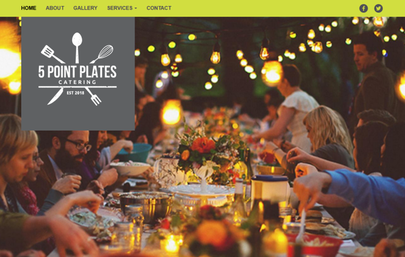

# Five Point Plates Drupal Website

A Drupal 8 website I built alongside Kellett Communications for the catering company 5 Point Plates. I implemented the design built by Kellett and built functionality such as menu and gallery content types. I used Quick Edit and Paragraph Types to allow the client to easily edit content.

# What I Learned

* Drupal 8
* Sass Theming
* Custom Blocks
* Content Types (such as Quick Edit and Paragraph Types)
* Views
* Twig Templates

Note: I just uploaded the themes/fivepointplates directory and removed everything that wasn’t my custom code or code that wasn't relevant for my custom code like /images and /bootstrap.

# Custom Code Locations

* themes/fivepointplates/templates
* themes/fivepointplates/sass/component
